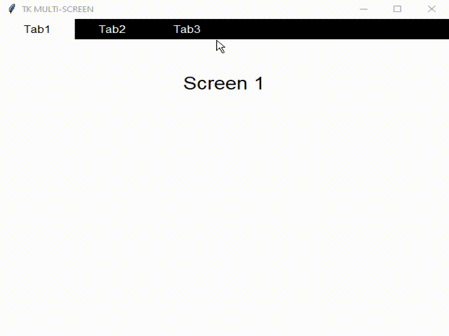

TK MULTI-SCREEN
===
**Template for Multiple Screens Wrapped in one single Tkinter Window**

    

Made With
---
  

Features
---
- Customizable colours, fonts, etc
- Compact and Easy to use
- No extra dependencies

Schematic
---
>MAIN WINDOW
>>FRAME(Toolbar)
>>>Tabs

>>FRAME(Screen)
>>>Widgets            

Usage 
---
>Download the code and modify as per your needs!

Example
---

License 
-------
**The MIT License (MIT)**

A short and simple permissive license with conditions only requiring preservation of copyright and license notices. Licensed works, modifications, and larger works may be distributed under different terms and without source code.

-------
_Made with :heart: in India by Vivek Kushal Chakraborty._
